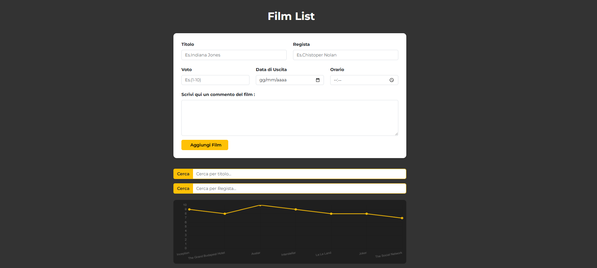
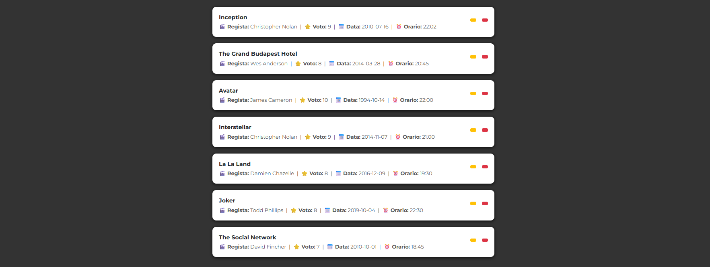
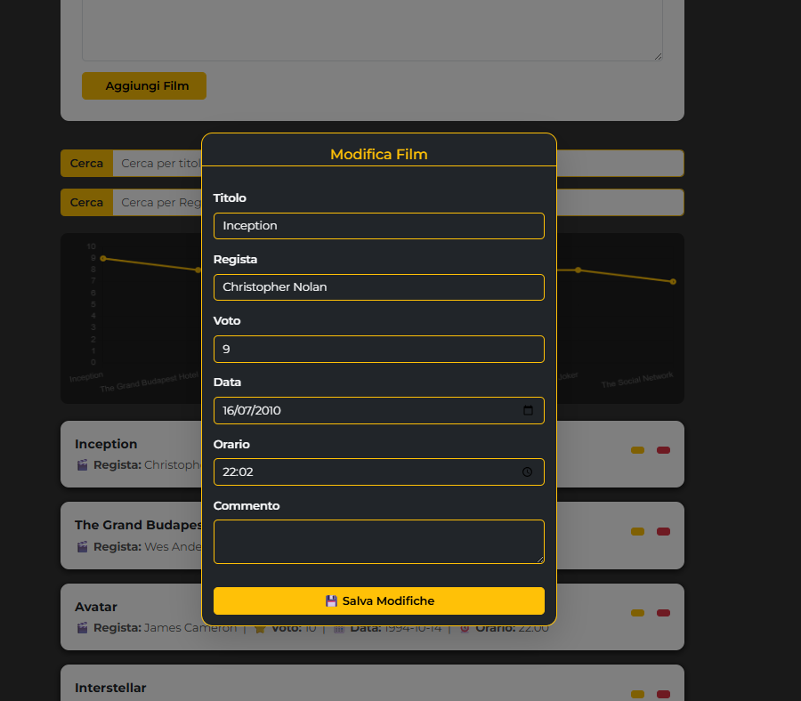
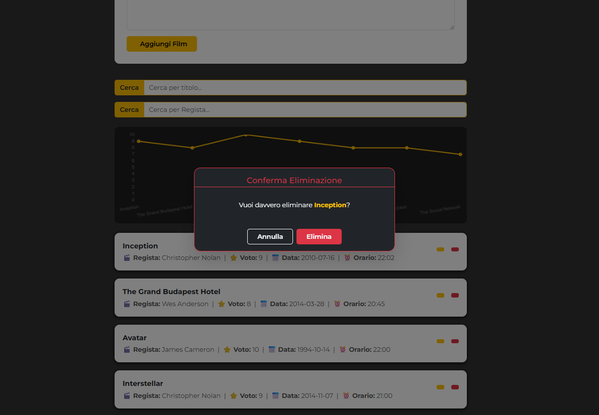

# Film List – JavaScript Web Application (API Integration)

Applicazione web sviluppata in JavaScript per la gestione di una lista di film tramite integrazione di API REST.
L’applicazione implementa funzionalità CRUD, ricerca dinamica e visualizzazione dei dati tramite grafico interattivo.

---

## Funzionalità

- Recupero e gestione dei film tramite API REST
- Operazioni CRUD complete (creazione, modifica, eliminazione)
- Ricerca e filtraggio in tempo reale
- Visualizzazione dei voti tramite grafico dinamico
- Interfaccia responsive

## Screenshot 

## Tecnologie Utilizzate

- HTML5
- CSS3
- JavaScript
- Bootstrap
- Fetch API
- Chart.js

